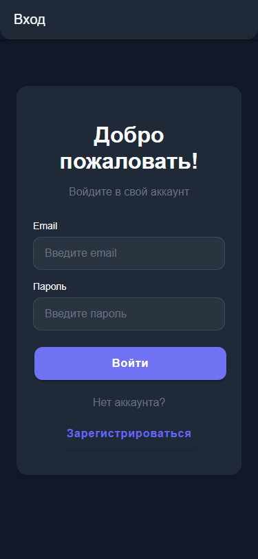
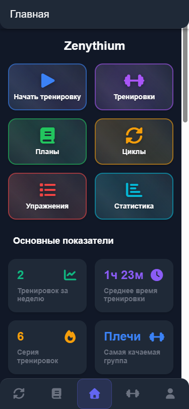
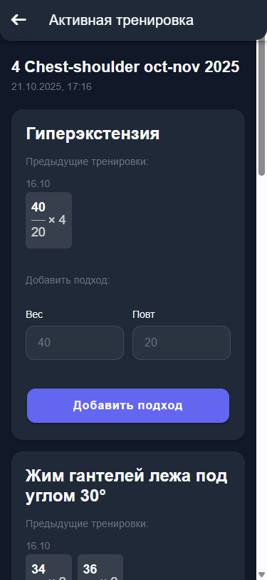
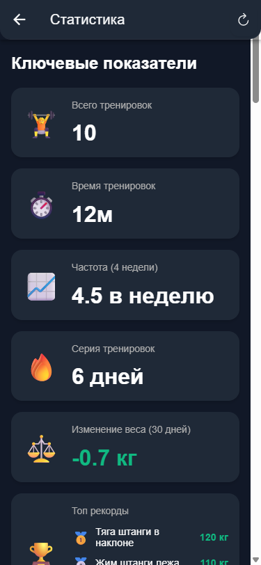

# 🏋️‍♂️ Zenythium - Mobile Fitness App

<div align="center">


**Мобильное приложение для управления тренировками и отслеживания прогресса**

[📱 Features](#-features) • [🚀 Quick Start](#-quick-start) • [📚 Documentation](#-documentation) • [🛠️ Development](#️-development)

</div>

---

## 📱 Features

### 🎯 Core Functionality
- **📊 Training Management** - Создание и управление тренировочными планами и циклами
- **🏃‍♂️ Active Workouts** - Интерактивные тренировки с отслеживанием подходов и весов
- **📈 Progress Tracking** - Детальная статистика и аналитика тренировок
- **💪 Exercise Database** - Обширная база упражнений с группировкой по мышцам
- **📏 Body Metrics** - Отслеживание веса, процента жира и других показателей
- **🏆 Personal Records** - Система персональных рекордов и достижений

### 🔧 Technical Features
- **🔐 Authentication** - Безопасная система входа и регистрации
- **📱 Native Performance** - Гибридное приложение с нативным UX
- **🌐 API Integration** - Полная интеграция с backend API
- **📊 Data Visualization** - Интерактивные графики и диаграммы
- **🔄 Real-time Sync** - Синхронизация данных в реальном времени

## 🚀 Quick Start

### Prerequisites
- **Node.js** 18+ 
- **Java 21** (для сборки Android)
- **Android Studio** с Android SDK
- **Git**

### Installation

```bash
# Clone the repository
git clone <repository-url>
cd ionic-vue-fitness-app

# Install dependencies
npm install

# Start development server
npm run dev
```

### Android Build

```bash
# Build debug APK
npm run build:android

# Build release APK
npm run build:android:release

# Or use batch scripts (Windows)
.\build-apk.bat          # Debug
.\build-release-apk.bat  # Release
```

### Version Management

```bash
# Update version
npm run version:patch    # Bug fixes
npm run version:minor    # New features  
npm run version:major    # Breaking changes
```

## 📚 Documentation

| Document | Description |
|----------|-------------|
| [🏗️ Architecture](docs/ARCHITECTURE.md) | Project structure and technical architecture |
| [🔌 API Integration](docs/API.md) | Backend API integration and data flow |
| [👨‍💻 Development Guide](docs/DEVELOPMENT.md) | Setup, coding standards, and best practices |
| [🤝 Contributing](docs/CONTRIBUTING.md) | Guidelines for contributors |
| [📋 Versioning](VERSIONING.md) | Version management and release process |

## 🛠️ Development

### Project Structure
```
src/
├── components/          # Reusable UI components
├── views/              # Page components
├── services/           # API and business logic
├── types/              # TypeScript definitions
├── composables/        # Vue composables
├── router/             # Navigation configuration
└── theme/              # Styling and themes
```

### Key Technologies
- **Ionic Vue 8** - UI framework and mobile components
- **Capacitor 7** - Native mobile functionality
- **Vue 3** - Reactive frontend framework
- **TypeScript** - Type-safe development
- **Axios** - HTTP client for API communication
- **Chart.js** - Data visualization
- **Vue Router** - Client-side routing

### Available Scripts
```bash
npm run dev              # Development server
npm run build            # Production build
npm run preview          # Preview production build
npm run test:unit        # Unit tests
npm run test:e2e         # End-to-end tests
npm run lint             # Code linting
```

## 📱 Screenshots

<div align="center">
  
  
  
  
</div>

*Скриншоты сделаны в мобильном разрешении 375x812 (18:9) для демонстрации реального пользовательского интерфейса*

## 🔗 Links

- **API Documentation**: [api-docs.json](api-docs.json)
- **Backend API**: https://api-zenythium.ru/
- **Version History**: [VERSIONING.md](VERSIONING.md)

## 📄 License

This project is private and proprietary. All rights reserved.

---

<div align="center">

**Built with ❤️ for fitness enthusiasts**

[Report Bug](issues) • [Request Feature](issues) • [Documentation](docs/)

</div>
